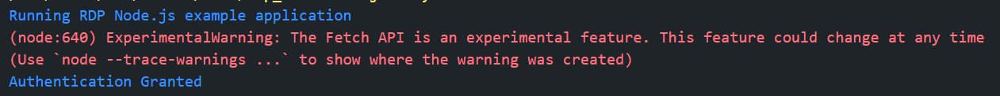
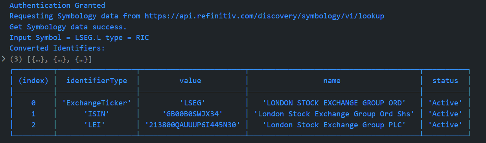

# Experiment Node.js native Fetch API with Refinitiv Data Platform APIs
- version: 1.0
- Last update: April 2022
- Environment: Docker
- Prerequisite: [Access to RDP credentials](#prerequisite)

Example Code Disclaimer:
ALL EXAMPLE CODE IS PROVIDED ON AN “AS IS” AND “AS AVAILABLE” BASIS FOR ILLUSTRATIVE PURPOSES ONLY. REFINITIV MAKES NO REPRESENTATIONS OR WARRANTIES OF ANY KIND, EXPRESS OR IMPLIED, AS TO THE OPERATION OF THE EXAMPLE CODE, OR THE INFORMATION, CONTENT, OR MATERIALS USED IN CONNECTION WITH THE EXAMPLE CODE. YOU EXPRESSLY AGREE THAT YOUR USE OF THE EXAMPLE CODE IS AT YOUR SOLE RISK.

## <a id="intro"></a>Introduction

The [Fetch API](https://developer.mozilla.org/en-US/docs/Web/API/Fetch_API) provides an interface for fetching resources asynchronously across the network using Promise. The Fetch API is wildly used by the frontend web developers for a while, but the [Node.js](https://nodejs.org/en/) just added this API as an experimental feature with Node version 17.5.0 on February 2022 for the backend developers. 

This example project shows how to use the Node.js experimental native Fetch API with the [Refinitiv Data Platform (RDP) APIs](https://developers.refinitiv.com/en/api-catalog/refinitiv-data-platform/refinitiv-data-platform-apis) as the example HTTP REST APIs. The application source codes are implemented in the [TypeScript](https://www.typescriptlang.org) language, and then run the application in a controlled environment such as Docker using the [Node Docker Image](https://hub.docker.com/_/node). This helps to avoid mess-up your local development environment with this experimental feature.

**Note**:
Please be informed that this demo projects aim for Development and POC purposes only. The native Fetch API is still an experimental feature (**As of April 2022**) and is not recommended for Production use.

## <a id="rdp_workflow"></a>RDP APIs Application Workflow

Refinitiv Data Platform entitlement check is based on OAuth 2.0 specification. The first step of an application workflow is to get a token from RDP Auth Service, which will allow access to the protected resource, i.e. data REST API's. 

The API requires the following access credential information:
- Username: The username. 
- Password: Password associated with the username. 
- Client ID: This is also known as ```AppKey```, and it is generated using an App key Generator. This unique identifier is defined for the user or application and is deemed confidential (not shared between users). The client_id parameter can be passed in the request body or as an “Authorization” request header that is encoded as base64.

Next, after the application received the Access Token (and authorization token) from RDP Auth Service, all subsequent REST API calls will use this token to get the data. Please find more detail regarding RDP APIs workflow in the following resources:
- [RDP APIs: Introduction to the Request-Response API](https://developers.refinitiv.com/en/api-catalog/refinitiv-data-platform/refinitiv-data-platform-apis/tutorials#introduction-to-the-request-response-api) page.
- [RDP APIs: Authorization - All about tokens](https://developers.refinitiv.com/en/api-catalog/refinitiv-data-platform/refinitiv-data-platform-apis/tutorials#authorization-all-about-tokens) page.

## <a id="code_structure"></a>Example Code Structure

The example application source codes are separated into 2 TypeScript files:
- The main file ```rdp_nodefetch.ts```: The file contains the application main and connection logic.
- The Type Aliases file ```rdp_types.ts```: This file contains all Type Aliases for the RDP Auth, News, and Discovery Symbology services JSON messages. 

## <a id="rdp_authen"></a>RDP APIs Authentication

### RDP APIs Authentication Type Aliases

Firstly, we create the TypeScript Type Aliases to define RDP APIs Login request message structure in the ```rdp_types.ts``` file. Type Aliases is one of [TypeScript Object Types](https://www.typescriptlang.org/docs/handbook/2/objects.html) that helps developers type-checking their variables and data in the implementation time to avoid data type errors in a final JavaScript application.

```
//rdp_types.ts

// Type for RDP Auth Token (v1) request message
export type RDP_AuthToken_Type = {
    username: string
    password?: string
    grant_type: 'password' | 'refresh_token'
    takeExclusiveSignOnControl: any
    scope?: string
    client_id: string
    refresh_token?: string
}
```

Next, import this ```RDP_AuthToken_Type``` Type to the main application ```rdp_nodefetch.ts``` file, and define all necessary variables for the API endpoints and credentials. 

```
//rdp_nodefetch.ts

// Importing Types
import { RDP_AuthToken_Type} from './rdp_types'

// RDP APIs endpoints
const rdpServer: string = process.env.RDP_BASE_URL || ''
const rdpAuthURL: string = process.env.RDP_AUTH_URL || ''

// RDP Credentials
const username: string = process.env.RDP_USERNAME || ''
const password: string = process.env.RDP_PASSWORD || ''
const client_id: string = process.env.RDP_APP_KEY || ''

const scope: string = 'trapi'
const takeExclusiveSignOnControl: boolean = true
// Access Token Information
let access_token: string = ''
let refresh_token: string = ''
let expires_in: string = ''

// ---------------- Main Function ---------------------------------------- //

const main = async () => {

}

// Running the application
main()

```
### Sending Authentication Request with the Fetch API

Then we create a function named ```authenRDP``` to send a login request message to the RDP Auth Token service. The function creates the JSON request message from the ```RDP_AuthToken_Type``` Type and then sends it to the RDP via Node native Fetch API as an HTTP POST message.

```
//rdp_nodefetch.ts

// Send HTTP Post request to get Access Token (Password Grant and Refresh Grant) from RDP Auth Service
const authenRDP = async (_username: string, _password: string, _clientid: string, _refresh_token: string) => {
    const authenURL: string = `${rdpServer}${rdpAuthURL}`

    //Init Authentication Request Message and First Login scenario
    let authReq: RDP_AuthToken_Type = {
        'username': _username,
        'client_id': _clientid,
        'password': _password,
        'scope': scope,
        'grant_type': 'password',
        takeExclusiveSignOnControl
    }

    // Send HTTP Request
    const response: Response = await fetch(authenURL, {
        method: 'POST',
        headers: {
            'Content-Type': 'application/x-www-form-urlencoded'
        },
        body: new URLSearchParams(authReq)
    })

    if (!response.ok) {
        console.log('Authentication Failed')
        const statusText: string = await response.text()
        throw new Error(`HTTP error!: ${response.status} ${statusText}`);
    }
    console.log('Authentication Granted')
    //Parse response to JSON
    const authResponse = await response.json()
    //Set Token Information
    access_token = authResponse.access_token
    refresh_token = authResponse.refresh_token
    expires_in = authResponse.expires_in

}

const main = async () => {

    console.log(`Running RDP Node.js example application`)
    try {

        //Send authentication request
        await authenRDP(username, password, client_id, refresh_token)
        if(access_token.length === 0 && refresh_token.length === 0 ){
            console.log('Error, exit the application')
            process.exit();
        }  

    } catch (error) {
        console.log(error)
        process.exit();
    }

}

// Running the application
main()

```

Once the authentication success, the function gets the RDP Auth service response message and keeps the following RDP token information in the variables.
- **access_token**: The token used to invoke REST data API calls as described above. The application must keep this credential for further RDP APIs requests.
- **refresh_token**: Refresh token to be used for obtaining an updated access token before expiration. The application must keep this credential for access token renewal.
- **expires_in**: Access token validity time in seconds.

Please note that Node.js may show the **ExperimentalWarning: The Fetch API is an experimental feature. This feature could change at any time** warning message because the application is currently using the experimental feature.



### RDP tokens renewal

Before the session expires, the application needs to send a Refresh Grant request message to get a new access token. Let' us modify the ```authenRDP()``` function to support the Refresh Grant request too.

```
//rdp_nodefetch.ts

// Send HTTP Post request to get Access Token (Password Grant and Refresh Grant) from RDP Auth Service
const authenRDP = async (_username: string, _password: string, _clientid: string, _refresh_token: string) => {
    const authenURL: string = `${rdpServer}${rdpAuthURL}`

     //Init Authentication Request Message and First Login scenario
    let authReq: RDP_AuthToken_Type = {
        ...
    }

    //For the Refresh_Token scenario
    if (_refresh_token.length !== 0) {
        authReq['refresh_token'] = _refresh_token,
            authReq['grant_type'] = 'refresh_token'
        delete authReq['scope']
        delete authReq['password']
    }

    // Send HTTP Request
    ...
    // Define the timer to refresh our token 
    setRefreshTimer()

}

//Send a Refresh Grant message before Access Token's expires (expires_in time)
const setRefreshTime = () => {

    const millis: number = (parseInt(expires_in) * 0.90) * 1000

    setInterval(async () => {
        try {
            await authenRDP(username, password, client_id, refresh_token)
        } catch (error) {
            console.log(error)
        }
    }, millis)
}

```

Now the example application supports both the Password Grant and Refresh Grant scenarios for the RDP APIs with a single ```authenRDP()``` function. You can find more detail about the Password and Refresh grants limitation in the following article.
* [Limitations and Guidelines for the RDP Authentication Service](https://developers.refinitiv.com/en/article-catalog/article/limitations-and-guidelines-for-the-rdp-authentication-service) article.

That covers the authentication part.

## <a id="rdp_get_data"></a>Requesting RDP APIs Data

That brings us to requesting the RDP APIs data. All subsequent REST API calls use the Access Token via the *Authorization* HTTP request message header as shown below to get the data. 
- Header: 
    * Authorization = ```Bearer <RDP Access Token>```

Please notice *the space* between the ```Bearer``` and ```RDP Access Token``` values.

The application then creates a request message in a JSON message format or URL query parameter based on the interested service and sends it as an HTTP request message to the Service Endpoint. Developers can get RDP APIs the Service Endpoint, HTTP operations, and parameters from Refinitiv Data Platform's [API Playground page](https://api.refinitiv.com/) - which is an interactive documentation site developers can access once they have a valid Refinitiv Data Platform account.

This project covers the following the RDP APIs Services:
- Discovery Symbology Service ```/lookup``` endpoint that navigates between identifiers.
- News Service ```/headlines``` operation.

## <a id="rdp_symbology"></a>RDP APIs Symbology Discovery Service

### RDP APIs Symbology Discovery Type Aliases

This example converts a symbol from the RIC Code identifier to [ISIN](https://en.wikipedia.org/wiki/International_Securities_Identification_Number), [LEI](https://en.wikipedia.org/wiki/Legal_Entity_Identifier), and [ExchangeTicker](https://en.wikipedia.org/wiki/Ticker_symbol) identifiers using the RDP the Discovery Symbology Service.  

I will begin by creating the Type Aliases for the Symbology JSON request message.


```
//rdp_types.ts

// Type for RDP Symbology Lookup request message
export type PDP_Symbology_Req_Type = {
    from: RDP_Symbology_From_Type[]
    to: RDP_Symbology_To_Type[]
    reference: string[]
    type: string
}

// sub-Type for RDP Symbology Lookup request message
export type RDP_Symbology_From_Type = {
    identifierTypes: string[]
    values: string[]
}

// sub-Type for RDP Symbology Lookup request message
export type RDP_Symbology_To_Type = {
    identifierTypes: string[]
}
```
### Sending Symbology Request with the Fetch API

Next, create a function named ```requestSymbol()``` in the main  ```rdp_nodefetch.ts``` file. This function creates the JSON request message, sends it to RDP via Node native Fetch API, and then returns a response data in JSON message format.

```
//rdp_nodefetch.ts

// Importing Types
import { PDP_Symbology_Req_Type} from './rdp_types'

// RDP APIs endpoints
const rdpSymbologyURL: string = process.env.RDP_SYMBOLOGY_URL || ''

// Request Symbology Lookup Data from RDP Symbology Lookup Service
const requestSymbol = async (symbol: string, access_token: string) => {
    const symbologyURL: string = `${rdpServer}${rdpSymbologyURL}`

    console.log(`Requesting Symbology data from ${symbologyURL}`)

    // Create POST request message
    const reqSymbolObj: PDP_Symbology_Req_Type = {
        'from': [{
            'identifierTypes': ['RIC'],
            'values': [symbol]
        }],
        'to': [{
            'identifierTypes': ['ISIN', 'LEI', 'ExchangeTicker']
        }],
        'reference': ['name', 'status', 'classification'],
        'type': 'auto'
    }

    // Send HTTP Request
    const response: Response = await fetch(symbologyURL, {
        method: 'POST',
        headers: {
            'Content-Type': 'application/json',
            'Authorization': `Bearer ${access_token}`
        },
        body: JSON.stringify(reqSymbolObj)
    })

    if (!response.ok) {
        const statusText: string = await response.text()
        throw new Error(`Get Symbology HTTP error!: ${response.status} ${statusText}`);
    }
    console.log('Get Symbology data success.')
    //Parse response to JSON
    return await response.json()
}

const main = async () => {
    
    // Authentication 
    ...
    const symbologyData = await requestSymbol(symbol, access_token)
    //console.log(JSON.stringify(symbologyData))
}

// Running the application
main()
```
### Displaying Symbology Data

The next step is displaying incoming Symbology data in a readable format. The application uses the [console.table()](https://nodejs.org/docs/latest-v18.x/api/console.html#consoletabletabulardata-properties) function to print data to a console in a tabular format.

Let's start by creating the new Type Aliases for the Symbology table object named ```symbologyTable```. This object keeps the necessary output data which are ```identifierType```, ```value```, ```name```, and ```status``` fields from the response JSON message.

```
//rdp_types.ts

// Type for RDP Symbology Table data
export type RDP_Symbology_Table_Type = {
    data: RDP_Symbology_Data_Type[]
}

// sub-Type for RDP Symbology Table data
export type RDP_Symbology_Data_Type = {
    identifierType: string
    value: string
    name: string
    status: string
}
```

Finally, we create a ```displaySymbology()``` function to construct the ```symbologyTable``` object and then passes it to the ```console.table()``` function.

```
//rdp_nodefetch.ts

// Importing Types
import { RDP_Symbology_Table_Type } from './rdp_types'
...
// Convert Symbology JSON data to be a table
const displaySymbology = (symbologyJSON:any) => {

    const symbologyData: any = symbologyJSON['data']
    const symbologyOutput: any  = symbologyData[0]['output']

    const symbologyTable: RDP_Symbology_Table_Type = { data: [] }
    symbologyOutput.forEach(({identifierType,value, name, status }:any)=>{
        symbologyTable['data'].push({
            identifierType,
            value,
            name,
            status
        })
    })

    ...
    console.table(symbologyTable['data'])
}

// Request Symbology Lookup Data from RDP Symbology Lookup Service
const requestSymbol = async (symbol: string, access_token: string) => {
    // Getting Symbology Data
    ... 
}

const main = async () => {
    
    // Authentication 
    ...
    const symbologyData = await requestSymbol(symbol, access_token)
    //console.log(JSON.stringify(symbologyData))
    displaySymbology(symbologyData)
}

// Running the application
main()
```

The ```console.table()``` result with the ```symbologyTable``` object is as follows:



That covers the Symbology data conversion part. 

## <a id="rdp_news"></a>RDP APIs News Service

### Sending News Request with the Fetch API

Now we come to the RDP News Service code. Let me start by creating a function named ```getNewsHeadlines``` to send the HTTP GET request message to RDP News Service with the native Fetch API. Once the function received response data from RDP, it returns that data in JSON message format.

```
//rdp_nodefetch.ts

// Request News Headlines Data from RDP News Service
const getNewsHeadlines = async (symbol: string, access_token: string, limit: number = 10) =>{
    const newsURL: string = `${rdpServer}${rdpNewsURL}?query=${symbol}&limit=${limit}`

    console.log(`Requesting News Headlines from ${newsURL}`)

    // Send HTTP Request
    const response: Response = await fetch(newsURL, {
        method: 'GET',
        headers: {
            'Content-Type': 'application/json',
            'Authorization': `Bearer ${access_token}`
        }
    })

    if (!response.ok) {
        const statusText: string = await response.text()
        throw new Error(`Get News Headlines HTTP error!: ${response.status} ${statusText}`);
    }
    console.log('Get News Headlines data success.')
    //Parse response to JSON
    return await response.json()
}

const main = async () => {
    
    // Authentication 
    ...
    const newsHeadlineData = await getNewsHeadlines(symbol, access_token, newsLimit)
    console.log(JSON.stringify(newsHeadlineData))
}

// Running the application
main()
```
### Displaying News Headline Data

Turning to display incoming news headline data in a readable-tabular format. I will begin by creating the new Type Aliases for the news headline table object named ```newsHeadlinesTable```. This object keeps the necessary output data which are ```storyId```, ```title``` (headline text), and ```versionCreated``` fields from the response JSON message.

```
//rdp_types.ts

// Type for RDP News Headline Table data
export type RDP_NewsHeadlines_Table_Type = {
    data: RDP_NewsHeadlines_Data_Type[]
}

// sub-Type for RDP News Headline Table data
export type RDP_NewsHeadlines_Data_Type = {
    storyId: string
    title: string
    versionCreated: string
}
```

Finally, we create a ```displayNewsHeadlines()``` function to construct the ```newsHeadlinesTable``` object and then passes it to the ```console.table()``` function.

```
//rdp_nodefetch.ts

// Importing Types
import { RDP_NewsHeadlines_Table_Type } from './rdp_types'
...
// Convert News Headline JSON data to be a table
const displayNewsHeadlines = (newsJSON:any) => {
    const newsData: any = newsJSON['data']
    let newsItem:any = undefined
    
    ...

    const newsHeadlinesTable: RDP_NewsHeadlines_Table_Type = { data: [] }
    newsData.forEach((headline:any) => {
        newsItem = headline['newsItem']

        newsHeadlinesTable['data'].push({
            'storyId': headline['storyId'],
            'title': newsItem['itemMeta']['title'][0]['$'],
            'versionCreated': newsItem['itemMeta']['versionCreated']['$']
        })
    })
    console.table(newsHeadlinesTable['data'])
}

// Request News Headlines Data from RDP News Service
const getNewsHeadlines = async (symbol: string, access_token: string, limit: number = 10) =>{
    // Getting News Headline Data
    ... 
}

const main = async () => {
    
    // Authentication 
    ...
    const newsHeadlineData = await getNewsHeadlines(symbol, access_token, newsLimit)
    //console.log(JSON.stringify(newsHeadlineData))
    displayNewsHeadlines(newsHeadlineData)
}

// Running the application
main()
```