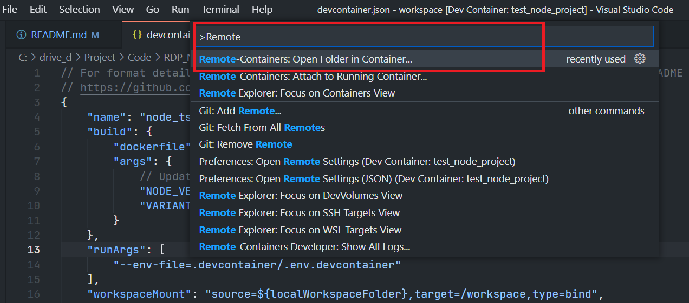
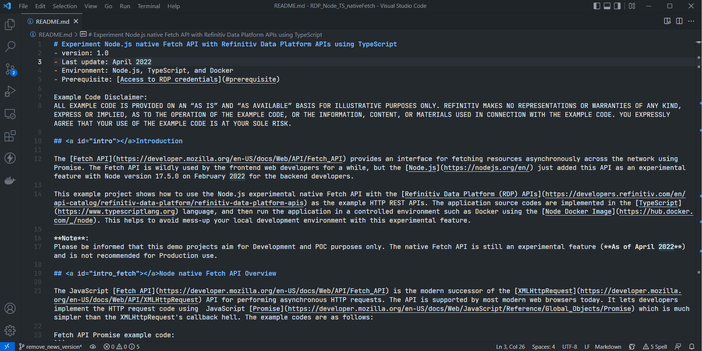
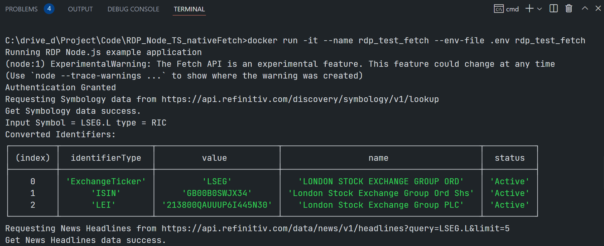

# Experiment Node.js native Fetch API with Refinitiv Data Platform APIs using TypeScript
- version: 1.0
- Last update: July, 2022
- Environment: Node.js, TypeScript, and Docker
- Prerequisite: [Access to RDP credentials](#prerequisite)

Example Code Disclaimer:
ALL EXAMPLE CODE IS PROVIDED ON AN “AS IS” AND “AS AVAILABLE” BASIS FOR ILLUSTRATIVE PURPOSES ONLY. REFINITIV MAKES NO REPRESENTATIONS OR WARRANTIES OF ANY KIND, EXPRESS OR IMPLIED, AS TO THE OPERATION OF THE EXAMPLE CODE, OR THE INFORMATION, CONTENT, OR MATERIALS USED IN CONNECTION WITH THE EXAMPLE CODE. YOU EXPRESSLY AGREE THAT YOUR USE OF THE EXAMPLE CODE IS AT YOUR SOLE RISK.

## <a id="intro"></a>Introduction

The [Fetch API](https://developer.mozilla.org/en-US/docs/Web/API/Fetch_API) provides an interface for fetching resources asynchronously across the network using Promise. The Fetch API is wildly used by the frontend web developers for a while, but the [Node.js](https://nodejs.org/en/) just added this API as an experimental feature with Node version 17.5.0 in February 2022 for the backend developers.

This example project shows how to use the Node.js experimental native Fetch API with the [Refinitiv Data Platform (RDP) APIs](https://developers.refinitiv.com/en/api-catalog/refinitiv-data-platform/refinitiv-data-platform-apis) as the example HTTP REST APIs. The application source codes are implemented in the [TypeScript](https://www.typescriptlang.org) language, and then run the application in a controlled environment such as [Docker](https://www.docker.com/) and [devcontainer](https://code.visualstudio.com/docs/remote/containers) using the [Node Docker Image](https://hub.docker.com/_/node). This helps to avoid mess-up your local development environment when experimenting with this feature.

**Note**:
Please be informed that this demo project aims for Development and POC purposes only. The native Fetch API is still an experimental feature (**As of April 2022**) and is not recommended for Production use.

## <a id="intro_fetch"></a>Node native Fetch API Overview

The JavaScript [Fetch API](https://developer.mozilla.org/en-US/docs/Web/API/Fetch_API) is the modern successor of the [XMLHttpRequest](https://developer.mozilla.org/en-US/docs/Web/API/XMLHttpRequest) API for performing asynchronous HTTP requests. The API is supported by most modern web browsers today. It lets developers implement the HTTP request code using  JavaScript [Promise](https://developer.mozilla.org/en-US/docs/Web/JavaScript/Reference/Global_Objects/Promise) which is much simpler than the XMLHttpRequest's callback hell. The example codes are as follows:

Fetch API Promise example code:
```
fetch('http://example.com')
  .then(response => response.json())
  .then(data => console.log(data));
```
Fetch API [async/await syntax](https://developer.mozilla.org/en-US/docs/Web/JavaScript/Reference/Statements/async_function) example code:
```
async function getData() {
    const response = await fetch('http://example.com')
    const data = await response.json()
    console.log(data)
}
```

While the frontend JavaScript web developers have been using the Fetch API since 2015, the API has not been included in the [Node.js](https://nodejs.org/en/) runtime environment. The backend JavaScript developers need to use the other libraries such as [the deprecated request module](https://www.npmjs.com/package/request), [postman-request](https://www.npmjs.com/package/postman-request), [Axios](https://www.npmjs.com/package/axios), [Node Fetch module](https://www.npmjs.com/package/node-fetch), etc to make the HTTP request with Promise on the Node server environment.

Introduction in [Node version 17.5.0](https://nodejs.org/en/blog/release/v17.5.0/), the **native Fetch API** is now available as an **experimental feature** (thanks to [Undici](https://undici.nodejs.org/#/)). The [Node version 18.0.0](https://nodejs.org/en/blog/release/v18.0.0/) also enables this experimental fetch API  on the global scope by default. The backend JavaScript developers do not need to install extra fetch-like modules anymore. The frontend developers will be familiar with the server-side HTTP request code in Node.js. 

Example code from [Node official page](https://nodejs.org/en/blog/release/v18.0.0/):
```
const res = await fetch('https://nodejs.org/api/documentation.json');
if (res.ok) {
  const data = await res.json();
  console.log(data);
}
```

To run this built-in API, you can run the native Fetch code with the ```--experimental-fetch``` with Node.js 17.5.0 or just a node command with Node.js 18.0.0 when you run the Node application as follow:

```
$> node app.js //node 18.0.0
$> node --experimental-fetch app.js //node 17.5.0
```

This example project is focusing on Node version 18.0.0.  

### <a id="whatis_rdp"></a>What are Refinitiv Data Platform (RDP) APIs?

The [Refinitiv Data Platform (RDP) APIs](https://developers.refinitiv.com/en/api-catalog/refinitiv-data-platform/refinitiv-data-platform-apis) provide various Refinitiv data and content for developers via easy-to-use Web-based API.

RDP APIs give developers seamless and holistic access to all of the Refinitiv content such as Historical Pricing, Environmental Social and Governance (ESG), News, Research, etc, and commingled with their content, enriching, integrating, and distributing the data through a single interface, delivered wherever they need it.  The RDP APIs delivery mechanisms are the following:
* Request - Response: RESTful web service (HTTP GET, POST, PUT or DELETE) 
* Alert: delivery is a mechanism to receive asynchronous updates (alerts) to a subscription. 
* Bulks:  deliver substantial payloads, like the end-of-day pricing data for the whole venue. 
* Streaming: deliver real-time delivery of messages.

This example project is focusing on the Request-Response: RESTful web service delivery method only.  

For more detail regarding the Refinitiv Data Platform, please see the following APIs resources: 
- [Quick Start](https://developers.refinitiv.com/en/api-catalog/refinitiv-data-platform/refinitiv-data-platform-apis/quick-start) page.
- [Tutorials](https://developers.refinitiv.com/en/api-catalog/refinitiv-data-platform/refinitiv-data-platform-apis/tutorials) page.
- [RDP APIs: Introduction to the Request-Response API](https://developers.refinitiv.com/en/api-catalog/refinitiv-data-platform/refinitiv-data-platform-apis/tutorials#introduction-to-the-request-response-api) page.
- [RDP APIs: Authorization - All about tokens](https://developers.refinitiv.com/en/api-catalog/refinitiv-data-platform/refinitiv-data-platform-apis/tutorials#authorization-all-about-tokens) page.

## <a id="prerequisite"></a>Prerequisite
This demo project requires the following dependencies.
1. RDP Access credentials.
2. [Visual Studio Code](https://code.visualstudio.com/) editor.
3. [Docker Desktop/Engine](https://docs.docker.com/get-docker/) application.
4. [VS Code - Remote Development extension pack](https://aka.ms/vscode-remote/download/extension)
5. Internet connection.

Please contact your Refinitiv representative to help you to access the RDP account and services. You can find more detail regarding the RDP access credentials set up from the lease see the *Getting Started for User ID* section of the [Getting Start with Refinitiv Data Platform](https://developers.refinitiv.com/en/article-catalog/article/getting-start-with-refinitiv-data-platform) article.

## <a id="devcontainer_detail"></a>Example Development Detail

Please see the full details over the example implementation on the [Development.md](Development.md) file.

##  <a id="project_files"></a>Project files
This example project contains the following files and folders
1. *.devcontainer/devcontainer.json*: An example devcontainer configuration file.
2. *.devcontainer/Dockerfile*: An example Dockerfile.
3. *.devcontainer/.env.devcontainer.example*: An example ```.env.devcontainer``` file.
4. *.vscode*: VS Code debugging configurations for compiling and running the example in VS Code devcontainer.
5. *src*: The TypeScript source code folder.
6. *images*: Project images folder.
7. *LICENSE.md*: Project's license file.
8. *README.md*: Project's README file.
9. *Dockerfile*: Project standalone Dockerfile. 
10. *.env.example*: Project standalone example ```.env``` file. 

## <a id="how_to_run"></a>How to run the Examples

The first step is to unzip or download the example project folder into a directory of your choice, then follow the steps below.

### <a id="devconainer_run"></a>Running as VS Code DevContainer

1. Go to the project's *.devcontainer* folder and create a file name ```.env.devcontainer```  with the following content.
    ```
    RDP_BASE_URL=https://api.refinitiv.com
    RDP_AUTH_URL=/auth/oauth2/v1/token
    RDP_AUTH_REVOKE_URL=/auth/oauth2/v1/revoke
    RDP_SYMBOLOGY_URL=/discovery/symbology/v1/lookup

    RDP_USERNAME=<RDP UserName>
    RDP_PASSWORD=<RDP Password>
    RDP_APP_KEY=<RDP Client_ID>
    ```
2. Start a Docker desktop or Docker engine on your machine.
4. Install the [VS Code - Remote Development extension pack](https://aka.ms/vscode-remote/download/extension).
5. Open the VS Code Command Palette with the ```F1``` key, and then select the **Remote-Containers: Reopen in Container** command.
    
6. Once this build completes, VS Code automatically connects to the container, and automatics initializes the project for developers. 

Now VS Code is ready for the RDP-TypeScript native Fetch API example inside this devcontainer.  Developers can build and run the example by pressing the ```F5``` button or selecting the *Run* then *Start Debugging* option from VS Code menu.



### <a id="manual_run"></a>Running as a manual Docker Container

If you want to run the example with a Docker container manually, please follow the steps below.

1. Start Docker
2. create a file name ```.env``` in a *project root* folder with the following content.
    ```
    RDP_BASE_URL=https://api.refinitiv.com
    RDP_AUTH_URL=/auth/oauth2/v1/token
    RDP_AUTH_REVOKE_URL=/auth/oauth2/v1/revoke
    RDP_ESG_URL=/data/environmental-social-governance/v2/views/scores-full
    RDP_SYMBOLOGY_URL=/discovery/symbology/v1/lookup

    RDP_USERNAME=<RDP UserName>
    RDP_PASSWORD=<RDP Password>
    RDP_APP_KEY=<RDP Client_ID>
    ```
3. Build a Docker image with the following command:
    ```
    $> docker build . -t rdp_test_fetch
    ```
4. Run a Docker container with the following command: 
    ```
    $> docker run -it --name rdp_test_fetch --env-file .env rdp_test_fetch --symbol <RIC> --newslimit <numbers of news limit>
    ```
5. To stop and delete a Docker container, press ``` Ctrl+C``` (or run ```docker stop rdp_test_fetch```) then run the following command:
    ```
    $> docker rm rdp_test_fetch
    ```


## <a id="summary"></a>Summary

The coming of the native Fetch API on Node.js is good news for all developers. This built-in API improves cross-platform familiarity for JavaScript/TypeScript developers, they do need to use a different approach for the frontend (web browsers) and backend (Node.js) HTTP request code anymore. This helps simplify the project and reduce the complexity of managing the 3rd party HTTP Request/Fetch modules. 

At the same time, the [Refinitiv Data Platform (RDP) APIs](https://developers.refinitiv.com/en/api-catalog/refinitiv-data-platform/refinitiv-data-platform-apis) provide various Refinitiv data and content for developers via an easy-to-use Web-based API. The APIs are easy to integrate into any application and platform that supports the HTTP protocol and JSON message format. 

Let me remind you again, this demo projects aim for Development and POC purposes only. The native Fetch API is still an experimental feature (**As of April 2022**) and is **not recommended for Production use**.

## <a id="references"></a>References

For further details, please check out the following resources:
* [Refinitiv Data Platform APIs page](https://developers.refinitiv.com/en/api-catalog/refinitiv-data-platform/refinitiv-data-platform-apis) on the [Refinitiv Developer Community](https://developers.refinitiv.com/) website.
* [Refinitiv Data Platform APIs Playground page](https://api.refinitiv.com).
* [Refinitiv Data Platform APIs: Introduction to the Request-Response API](https://developers.refinitiv.com/en/api-catalog/refinitiv-data-platform/refinitiv-data-platform-apis/tutorials#introduction-to-the-request-response-api).
* [Refinitiv Data Platform APIs: Authorization - All about tokens](https://developers.refinitiv.com/en/api-catalog/refinitiv-data-platform/refinitiv-data-platform-apis/tutorials#authorization-all-about-tokens).
* [Limitations and Guidelines for the RDP Authentication Service](https://developers.refinitiv.com/en/article-catalog/article/limitations-and-guidelines-for-the-rdp-authentication-service) article.
* [Getting Started with Refinitiv Data Platform](https://developers.refinitiv.com/en/article-catalog/article/getting-start-with-refinitiv-data-platform) article.
* [Node version 18.0.0](https://nodejs.org/en/blog/release/v18.0.0/) page.
* [Typescript TSC](https://www.typescriptlang.org/docs/handbook/compiler-options.html) page.
* [TypeScript Handbook](https://www.typescriptlang.org/docs/handbook/intro.html) page.
* [The Fetch API is finally coming to Node.js](https://blog.logrocket.com/fetch-api-node-js/) blog post.
* [Node.js 18 available with Fetch API enabled by default](https://sdtimes.com/softwaredev/node-js-18-available-with-fetch-api-enabled-by-default/) news.
* [VS Code: Developing inside a Container](https://code.visualstudio.com/docs/remote/containers) page.
* [VS Code: Remote development in Containers tutorial](https://code.visualstudio.com/docs/remote/containers-tutorial) page.

For any questions related to Refinitiv Data Platform APIs, please use the [RDP APIs Forum](https://community.developers.refinitiv.com/spaces/231/index.html) on the [Developers Community Q&A page](https://community.developers.refinitiv.com/).